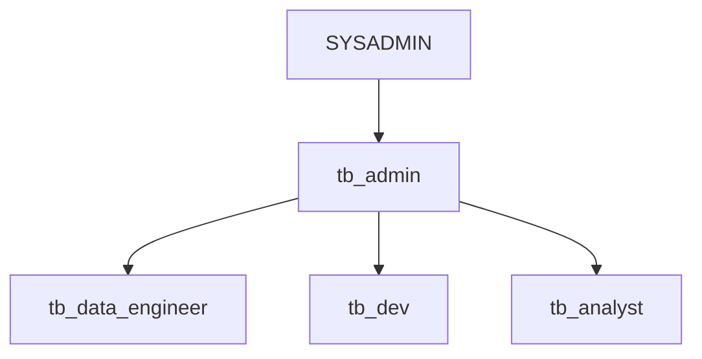

# Module 00: 環境セットアップ

> 🎯 **目標**: ハンズオン用のSnowflake環境を構築する

---

## 📂 このモジュールで使用するファイル

| ファイル | 説明 | 使い方 |
|---------|------|--------|
| [`setup.sql`](./setup.sql) | **セットアップスクリプト** | Snowsightで全選択→実行 |
| [`cleanup.sql`](./cleanup.sql) | クリーンアップ用 | ハンズオン終了後に実行 |

---

## ⏱️ 所要時間

**約10-15分**（データロード含む）

---

## 📋 作成されるオブジェクト

### データベース

```
TB_101
├── raw_pos           ← 生のPOSデータ
├── raw_customer      ← 生の顧客データ
├── raw_support       ← 生のサポートデータ
├── harmonized        ← 整形済みデータ
├── analytics         ← 分析用ビュー
├── governance        ← ガバナンス用
└── semantic_layer    ← セマンティックレイヤー
```

### ウェアハウス

| 名前 | サイズ | 用途 |
|------|-------|------|
| `tb_de_wh` | Large→XSmall | データエンジニアリング |
| `tb_dev_wh` | XSmall | 開発用 |
| `tb_analyst_wh` | Large | 分析用 |
| `tb_cortex_wh` | Large | Cortex AI用 |

### ロール階層



---

# 🔰 セットアップ手順

## Step 1: Snowsightにログイン

1. [Snowflake](https://app.snowflake.com/) にアクセス
2. アカウント情報を入力してログイン

> 💡 トライアルアカウントでも実行可能です

---

## Step 2: SQLワークシートを作成

1. 左メニューの **Worksheets** をクリック
2. 右上の **+** → **SQL Worksheet** を選択

---

## Step 3: セットアップスクリプトを実行

### 3-1. スクリプトをコピー

[`setup.sql`](./setup.sql) の内容をすべてコピーします。

### 3-2. ワークシートに貼り付け

作成したワークシートに貼り付けます。

### 3-3. 全選択して実行

```
Mac:     Cmd + A → Cmd + Enter
Windows: Ctrl + A → Ctrl + Enter
```

> ⏱️ 約10-15分かかります（データロードのため）

---

## Step 4: セットアップ完了の確認

以下のクエリで確認できます：

```sql
-- データベースの確認
SHOW DATABASES LIKE 'TB_101';

-- スキーマの確認
SHOW SCHEMAS IN DATABASE TB_101;

-- ウェアハウスの確認
SHOW WAREHOUSES LIKE 'TB%';

-- ロールの確認
SHOW ROLES LIKE 'TB%';

-- サンプルデータの確認
SELECT COUNT(*) FROM tb_101.raw_pos.order_header;
```

---

## ✅ セットアップ完了チェックリスト

- [ ] `TB_101` データベースが作成された
- [ ] 7つのスキーマが作成された
- [ ] 4つのウェアハウスが作成された
- [ ] 4つのロールが作成された
- [ ] `raw_pos.order_header` にデータがロードされた

---

## ❌ トラブルシューティング

### 権限エラーが出る場合

```
Error: Insufficient privileges to operate on...
```

**解決策**: `ACCOUNTADMIN` ロールで実行してください

```sql
USE ROLE accountadmin;
```

### ウェアハウスが起動しない場合

```
Error: Warehouse is suspended
```

**解決策**: ウェアハウスを手動で起動

```sql
ALTER WAREHOUSE tb_de_wh RESUME;
```

### データロードに失敗する場合

**解決策**: ネットワーク接続を確認し、再実行してください

---

## 🧹 クリーンアップ（ハンズオン終了後）

ハンズオン終了後、環境を削除する場合：

```sql
-- cleanup.sql を実行
-- または以下を実行

USE ROLE accountadmin;

DROP DATABASE IF EXISTS tb_101;
DROP WAREHOUSE IF EXISTS tb_de_wh;
DROP WAREHOUSE IF EXISTS tb_dev_wh;
DROP WAREHOUSE IF EXISTS tb_analyst_wh;
DROP WAREHOUSE IF EXISTS tb_cortex_wh;
DROP ROLE IF EXISTS tb_admin;
DROP ROLE IF EXISTS tb_data_engineer;
DROP ROLE IF EXISTS tb_dev;
DROP ROLE IF EXISTS tb_analyst;
```

> ⚠️ **注意**: クリーンアップを実行すると、すべてのデータが削除されます

---

## ➡️ 次のステップ

| 次のモジュール | 内容 |
|--------------|------|
| [01_getting_started](../01_getting_started/) | Snowflakeの基本操作を学ぶ |

---

## 📊 ロードされるデータについて

### Tasty Bytes とは？

架空のフードトラック企業で、世界中で営業しています。

| データ | 説明 |
|-------|------|
| **注文データ** | 売上、メニュー、トラック情報 |
| **顧客データ** | ロイヤルティプログラム情報 |
| **レビューデータ** | 顧客からのフィードバック |
| **位置データ** | トラックの営業場所 |

### データ量（概算）

| テーブル | 行数 |
|---------|------|
| `order_header` | 約200万行 |
| `order_detail` | 約500万行 |
| `customer_loyalty` | 約10万行 |
| `truck_reviews` | 約5万行 |
