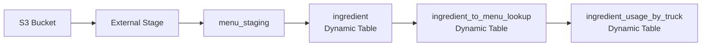

# Module 02: シンプルなデータパイプライン

> 🎯 **目標**: Dynamic Tablesで宣言的なデータパイプラインを構築する

---

## 📂 このモジュールで使用するファイル

| ファイル | 説明 | 使い方 |
|---------|------|--------|
| [`data_pipelines.sql`](./data_pipelines.sql) | **メインスクリプト** | Snowsightで開いて順番に実行 |
| [`reset.sql`](./reset.sql) | リセット用 | やり直したい時に実行 |
| `slides/02_simple_data_pipelines.pdf` | 参考PDF | ※外部リンクあり、本READMEを推奨 |

> ⚠️ **注意**: PDFは参考資料です。手順はこのREADMEと`data_pipelines.sql`に従ってください。

---

## ⏱️ 所要時間

**約45分**（説明含む）

---

## 🎓 学習内容

```
┌─────────────────────────────────────────────────────────────────┐
│  1. 外部ステージ     → S3からデータを取り込む                   │
│  2. VARIANTデータ    → 半構造化JSONを操作する                   │
│  3. Dynamic Tables   → 自動更新されるテーブルを作成             │
│  4. パイプライン構築 → 複数のDynamic Tablesを連携               │
│  5. DAG可視化        → データフローをグラフで確認               │
└─────────────────────────────────────────────────────────────────┘
```

---

## 🏗️ 構築するパイプライン



---

# 🔰 ハンズオン手順

## Step 0: 準備

### SQLファイルを開く

1. **Snowsight** にログイン
2. **Worksheets** → **+** → **SQL Worksheet**
3. [`data_pipelines.sql`](./data_pipelines.sql) の内容をコピー＆ペースト

### コンテキストを設定

```sql
-- data_pipelines.sql: 22-24行目
USE DATABASE tb_101;
USE ROLE tb_data_engineer;
USE WAREHOUSE tb_de_wh;
```

> 💡 今回は **データエンジニア** ロールを使用します

---

## Step 1: 外部ステージからのデータ取り込み

📍 **SQLファイル**: [`data_pipelines.sql`](./data_pipelines.sql) の **26〜69行目**

### 1-1. ステージとは？

```
┌─────────────────────────────────────────────────────────┐
│  ステージ = データファイルの保存場所                     │
│                                                         │
│  ・S3、Azure Blob、GCSなどへの参照                      │
│  ・COPY INTO でテーブルにロード                         │
│  ・ファイル形式（CSV、JSON等）を指定                    │
└─────────────────────────────────────────────────────────┘
```

### 1-2. ステージを作成

```sql
CREATE OR REPLACE STAGE raw_pos.menu_stage
COMMENT = 'メニューデータ用ステージ'
URL = 's3://sfquickstarts/frostbyte_tastybytes/raw_pos/menu/'
FILE_FORMAT = public.csv_ff;
```

### 1-3. ステージングテーブルを作成

```sql
CREATE OR REPLACE TABLE raw_pos.menu_staging
(
    menu_id NUMBER(19,0),
    menu_type_id NUMBER(38,0),
    menu_type VARCHAR(16777216),
    truck_brand_name VARCHAR(16777216),
    menu_item_id NUMBER(38,0),
    menu_item_name VARCHAR(16777216),
    item_category VARCHAR(16777216),
    item_subcategory VARCHAR(16777216),
    cost_of_goods_usd NUMBER(38,4),
    sale_price_usd NUMBER(38,4),
    menu_item_health_metrics_obj VARIANT  -- 👈 半構造化データ！
);
```

### 1-4. データをロード

```sql
COPY INTO raw_pos.menu_staging FROM @raw_pos.menu_stage;
```

### 1-5. 確認

```sql
SELECT * FROM raw_pos.menu_staging;
```

---

## Step 2: 半構造化データの操作

📍 **SQLファイル**: [`data_pipelines.sql`](./data_pipelines.sql) の **71〜124行目**

### 2-1. VARIANTデータを確認

```sql
SELECT menu_item_health_metrics_obj FROM raw_pos.menu_staging;
```

> 📝 JSONのようなネストされた構造が見えます

### VARIANTの構造

```json
{
  "menu_item_id": 123,
  "menu_item_health_metrics": [
    {
      "ingredients": ["Chicken", "Rice", "Sauce"],
      "is_dairy_free_flag": "Y",
      "is_gluten_free_flag": "N"
    }
  ]
}
```

### 2-2. コロン演算子でアクセス

```sql
SELECT
    menu_item_name,
    menu_item_health_metrics_obj:menu_item_id::INTEGER AS menu_item_id,
    menu_item_health_metrics_obj:menu_item_health_metrics[0]:ingredients::ARRAY AS ingredients
FROM raw_pos.menu_staging;
```

| 演算子 | 用途 | 例 |
|-------|------|-----|
| `:` | キーにアクセス | `obj:key` |
| `[]` | 配列要素にアクセス | `arr[0]` |
| `::` | 型をキャスト | `value::STRING` |

### 2-3. FLATTENで配列を展開

```sql
SELECT
    i.value::STRING AS ingredient_name,
    m.menu_item_health_metrics_obj:menu_item_id::INTEGER AS menu_item_id
FROM
    raw_pos.menu_staging m,
    LATERAL FLATTEN(INPUT => m.menu_item_health_metrics_obj:menu_item_health_metrics[0]:ingredients::ARRAY) i;
```

> 💡 **FLATTEN**: 配列の各要素を行として展開

---

## Step 3: Dynamic Tablesの作成

📍 **SQLファイル**: [`data_pipelines.sql`](./data_pipelines.sql) の **126〜215行目**

### Dynamic Tableとは？

```
┌─────────────────────────────────────────────────────────┐
│  Dynamic Table = 自動更新されるマテリアライズドビュー    │
│                                                         │
│  ✅ 宣言的: SELECTでデータを定義                        │
│  ✅ 自動更新: ソースが変わると自動で反映                │
│  ✅ LAG指定: 更新頻度を制御（例: 1分ごと）              │
└─────────────────────────────────────────────────────────┘
```

### 3-1. ingredient Dynamic Tableを作成

```sql
CREATE OR REPLACE DYNAMIC TABLE harmonized.ingredient
    LAG = '1 minute'
    WAREHOUSE = 'TB_DE_WH'
AS
    SELECT
        ingredient_name,
        menu_ids
    FROM (
        SELECT DISTINCT
            i.value::STRING AS ingredient_name,
            ARRAY_AGG(m.menu_item_id) AS menu_ids
        FROM
            raw_pos.menu_staging m,
            LATERAL FLATTEN(INPUT => menu_item_health_metrics_obj:menu_item_health_metrics[0]:ingredients::ARRAY) i
        GROUP BY i.value::STRING
    );
```

### 3-2. 確認

```sql
SELECT * FROM harmonized.ingredient;
```

### 3-3. 新しいメニューを追加（自動更新のテスト）

```sql
INSERT INTO raw_pos.menu_staging 
SELECT 
    10101, 15, 'Sandwiches', 'Better Off Bread', 157, 'Banh Mi',
    'Main', 'Cold Option', 9.0, 12.0,
    PARSE_JSON('{
      "menu_item_health_metrics": [{
        "ingredients": ["French Baguette", "Mayonnaise", "Pickled Daikon", "Cucumber", "Pork Belly"],
        "is_dairy_free_flag": "N", "is_gluten_free_flag": "N", "is_healthy_flag": "Y", "is_nut_free_flag": "Y"
      }],
      "menu_item_id": 157
    }');
```

### 3-4. 自動更新を確認（最大1分待つ）

```sql
SELECT * FROM harmonized.ingredient 
WHERE ingredient_name IN ('French Baguette', 'Pickled Daikon');
```

> ⏱️ LAG = 1分なので、最大1分で反映されます

---

## Step 4: パイプラインの構築

📍 **SQLファイル**: [`data_pipelines.sql`](./data_pipelines.sql) の **217〜332行目**

### 4-1. 成分→メニュー ルックアップを作成

```sql
CREATE OR REPLACE DYNAMIC TABLE harmonized.ingredient_to_menu_lookup
    LAG = '1 minute'
    WAREHOUSE = 'TB_DE_WH'    
AS
SELECT
    i.ingredient_name,
    m.menu_item_health_metrics_obj:menu_item_id::INTEGER AS menu_item_id
FROM
    raw_pos.menu_staging m,
    LATERAL FLATTEN(INPUT => m.menu_item_health_metrics_obj:menu_item_health_metrics[0]:ingredients) f
JOIN harmonized.ingredient i ON f.value::STRING = i.ingredient_name;
```

### 4-2. 注文データを挿入

```sql
-- 注文ヘッダー
INSERT INTO raw_pos.order_header
SELECT 459520441, 15, 1030, 101565, null, 200322900,
    TO_TIMESTAMP_NTZ('08:00:00', 'hh:mi:ss'),
    TO_TIMESTAMP_NTZ('14:00:00', 'hh:mi:ss'),
    null, TO_TIMESTAMP_NTZ('2022-01-27 08:21:08.000'),
    null, 'USD', 14.00, null, null, 14.00;

-- 注文明細
INSERT INTO raw_pos.order_detail
SELECT 904745311, 459520441, 157, null, 0, 2, 14.00, 28.00, null;
```

### 4-3. トラック別成分使用量テーブルを作成

```sql
CREATE OR REPLACE DYNAMIC TABLE harmonized.ingredient_usage_by_truck 
    LAG = '2 minute'
    WAREHOUSE = 'TB_DE_WH'  
AS 
    SELECT
        oh.truck_id,
        EXTRACT(YEAR FROM oh.order_ts) AS order_year,
        MONTH(oh.order_ts) AS order_month,
        i.ingredient_name,
        SUM(od.quantity) AS total_ingredients_used
    FROM raw_pos.order_detail od
    JOIN raw_pos.order_header oh ON od.order_id = oh.order_id
    JOIN harmonized.ingredient_to_menu_lookup iml ON od.menu_item_id = iml.menu_item_id
    JOIN harmonized.ingredient i ON iml.ingredient_name = i.ingredient_name
    JOIN raw_pos.location l ON l.location_id = oh.location_id
    WHERE l.country = 'United States'
    GROUP BY oh.truck_id, order_year, order_month, i.ingredient_name
    ORDER BY oh.truck_id, total_ingredients_used DESC;
```

### 4-4. 成分使用量を確認

```sql
SELECT
    truck_id,
    ingredient_name,
    SUM(total_ingredients_used) AS total_ingredients_used
FROM harmonized.ingredient_usage_by_truck
WHERE order_month = 1 AND truck_id = 15
GROUP BY truck_id, ingredient_name
ORDER BY total_ingredients_used DESC;
```

---

## Step 5: DAGによる可視化

📍 **SQLファイル**: [`data_pipelines.sql`](./data_pipelines.sql) の **334〜350行目**

### 5-1. DAGにアクセス

1. **Catalog** → **TB_101** → **HARMONIZED** → **Dynamic Tables**
2. **INGREDIENT** をクリック
3. **Graph** タブをクリック

### 見えるもの

```
┌─────────────────────────────────────────────────────────┐
│                        DAG View                         │
│                                                         │
│   menu_staging                                          │
│        │                                                │
│        ▼                                                │
│   ingredient (LAG: 1min)                                │
│        │                                                │
│        ▼                                                │
│   ingredient_to_menu_lookup (LAG: 1min)                 │
│        │                                                │
│        ▼                                                │
│   ingredient_usage_by_truck (LAG: 2min)                 │
└─────────────────────────────────────────────────────────┘
```

> 💡 各ノードをクリックすると、LAG設定や最終更新時刻を確認できます

---

# 🎉 完了！

```sql
SELECT '🎉 Module 02 完了！次は Module 03: Cortex AI に進みましょう。' AS message;
```

---

## 🔄 リセット

やり直したい場合は [`reset.sql`](./reset.sql) を実行してください。

---

## ➡️ 次のステップ

| 次のモジュール | 内容 |
|--------------|------|
| [03_cortex_ai](../03_cortex_ai/) | Cortex AI SQL関数でレビュー分析 |

---

## 📚 参考リンク（任意）

- [ステージの概要](https://docs.snowflake.com/en/user-guide/data-load-overview)
- [半構造化データ](https://docs.snowflake.com/en/sql-reference/data-types-semistructured)
- [Dynamic Tables](https://docs.snowflake.com/en/user-guide/dynamic-tables-about)
- [FLATTEN関数](https://docs.snowflake.com/en/sql-reference/functions/flatten)
