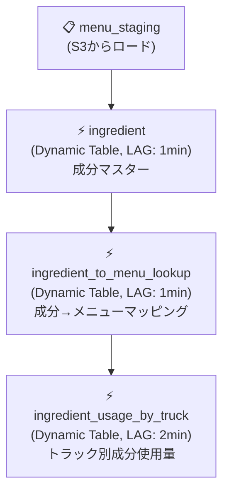

# Module 02: シンプルなデータパイプライン

外部ステージからのデータ取り込み、半構造化データの操作、Dynamic Tablesによる宣言的なデータパイプラインの構築を学びます。

---

## 📋 概要

**所要時間**: 約45分

### 学習目標

このモジュールを完了すると、以下ができるようになります：

- ✅ 外部ステージ（S3）からのデータ取り込み
- ✅ 半構造化データ（VARIANT）の操作
- ✅ FLATTEN関数によるネストデータの展開
- ✅ Dynamic Tablesによる宣言的ETL
- ✅ DAGによるパイプラインの可視化

---

## 📚 トピック

### 1. 外部ステージからの取り込み

**ステージとは**: データファイルが保存されている場所を指定する名前付きオブジェクト

```sql
-- 外部ステージの作成
CREATE STAGE my_stage
    URL = 's3://bucket/path/'
    FILE_FORMAT = my_format;

-- データのロード
COPY INTO my_table FROM @my_stage;
```

### 2. 半構造化データとVARIANTデータ型

**VARIANT**: JSON, Avro, ORC, Parquet, XMLなどを格納できるデータ型

```sql
-- キーへのアクセス（コロン演算子）
SELECT column:key FROM table;

-- 配列へのアクセス（角括弧）
SELECT column:array[0] FROM table;

-- 型キャスト
SELECT column:key::STRING FROM table;
```

### 3. FLATTEN関数

**目的**: 配列やオブジェクトを展開して行を生成

```sql
SELECT f.value
FROM table,
LATERAL FLATTEN(INPUT => column:array) f;
```

### 4. Dynamic Tables

**特徴**:
- 宣言的な構文（「何を」を定義、「どのように」はSnowflakeが管理）
- 自動データ更新（LAG設定）
- 下流テーブルへの自動伝播

```sql
CREATE DYNAMIC TABLE my_dt
    LAG = '1 minute'
    WAREHOUSE = 'my_wh'
AS
    SELECT ... FROM source_table;
```

### 5. DAG（有向非巡回グラフ）

**目的**: データパイプラインの依存関係を視覚化

- Snowsightのカタログから確認可能
- 各Dynamic TableのLAGメトリクスを表示
- 手動更新のオプション

---

## 🔧 ハンズオン手順

### Step 1: コンテキストの設定

```sql
USE DATABASE tb_101;
USE ROLE tb_data_engineer;
USE WAREHOUSE tb_de_wh;
```

### Step 2: 外部ステージの作成とデータロード

1. S3バケットを参照するステージを作成
2. ステージングテーブルを作成
3. COPY INTOでデータをロード

### Step 3: 半構造化データの操作

1. VARIANTデータを確認
2. コロン演算子でデータを抽出
3. FLATTENで配列を展開

### Step 4: Dynamic Tablesの作成

1. 成分テーブル（ingredient）を作成
2. メニュー→成分ルックアップテーブルを作成
3. トラック別成分使用量テーブルを作成

### Step 5: 自動更新の確認

1. 新しいメニューアイテムを追加
2. Dynamic Tableの自動更新を確認（最大1分待機）

### Step 6: DAGの確認

1. Snowsightのカタログを開く
2. Dynamic Tablesのグラフタブを確認

---

## 📁 ファイル構成

| ファイル | 説明 |
|---------|------|
| `data_pipelines.sql` | メインSQLスクリプト |
| `reset.sql` | モジュールのリセットスクリプト |
| `slides/` | スライド資料 |

---

## 🏗️ パイプラインアーキテクチャ



---

## ⚠️ 注意事項

### Dynamic Tableの更新待ち

- LAG設定に基づいて更新されます
- 即座に更新されない場合は、設定時間まで待ってください
- Snowsightで更新状況を確認できます

### VARIANTデータの型キャスト

- 抽出したデータはVARIANT型のままです
- クエリパフォーマンス向上のため、明示的に型キャストしてください

---

## 🔄 リセット

このモジュールで作成したオブジェクトをクリーンアップする場合：

```sql
-- reset.sql を実行
```

---

## ✅ 確認問題

1. Dynamic TableとViewの違いは何ですか？

2. FLATTENはどのような場合に使用しますか？

3. LAG設定が「1 minute」の場合、データはどのタイミングで更新されますか？

---

## 📖 参考リンク

- [COPY INTO](https://docs.snowflake.com/en/sql-reference/sql/copy-into-table)
- [半構造化データ](https://docs.snowflake.com/en/sql-reference/data-types-semistructured)
- [Dynamic Tables](https://docs.snowflake.com/en/user-guide/dynamic-tables-about)
- [FLATTEN](https://docs.snowflake.com/en/sql-reference/functions/flatten)

---

## ➡️ 次のステップ

[Module 03: Cortex AI](../03_cortex_ai/) に進んでください。

