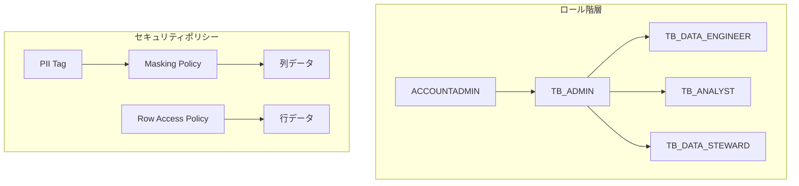

# Module 04: Horizonによるガバナンス

> 🎯 **目標**: RBAC、マスキング、行アクセスポリシーでデータを保護する

---

## 📂 このモジュールで使用するファイル

| ファイル | 説明 | 使い方 |
|---------|------|--------|
| [`governance.sql`](./governance.sql) | **メインスクリプト** | Snowsightで開いて順番に実行 |
| [`reset.sql`](./reset.sql) | リセット用 | やり直したい時に実行 |

---

## ⏱️ 所要時間

**約45分**（説明含む）

---

## 🎓 学習内容

| # | トピック | 内容 |
|---|---------|------|
| 1 | RBAC | ロールベースアクセス制御 |
| 2 | 自動タグ付け | PIIを自動検出・分類 |
| 3 | マスキングポリシー | 列レベルセキュリティ |
| 4 | 行アクセスポリシー | 行レベルセキュリティ |
| 5 | DMF | データ品質監視 |
| 6 | トラストセンター | アカウントセキュリティ監視 |

---

## 🔒 セキュリティアーキテクチャ



---

# 🔰 ハンズオン手順

## Step 0: 準備

### SQLファイルを開く

1. **Snowsight** にログイン
2. **Projects** → **Workspaces** でハンズオン用ワークスペースを開く
3. ファイルエクスプローラーで `04_governance/governance.sql` を開く

### コンテキストを設定

画面右上のコンテキストパネルで以下を設定：
- **Role**: `USERADMIN`
- **Database**: `TB_101`
- **Warehouse**: `TB_DEV_WH`

```sql
-- governance.sql: 21-23行目
USE ROLE useradmin;
USE DATABASE tb_101;
USE WAREHOUSE tb_dev_wh;
```

---

## Step 1: ロールベースアクセス制御（RBAC）

📍 **SQLファイル**: [`governance.sql`](./governance.sql) の **25〜117行目**

### RBACとは？

**RBAC** = Role-Based Access Control（ユーザー → ロール → 権限）

- ✅ 権限はロールに付与
- ✅ ロールはユーザーに付与
- ✅ ロール間で継承が可能

### 1-1. 現在のロールを確認

```sql
SHOW ROLES;
```

### 1-2. データスチュワードロールを作成

```sql
CREATE OR REPLACE ROLE tb_data_steward
    COMMENT = 'カスタムロール';
```

### 1-3. 権限を付与

```sql
USE ROLE securityadmin;

-- ウェアハウス権限
GRANT OPERATE, USAGE ON WAREHOUSE tb_dev_wh TO ROLE tb_data_steward;

-- データベース権限
GRANT USAGE ON DATABASE tb_101 TO ROLE tb_data_steward;
GRANT USAGE ON ALL SCHEMAS IN DATABASE tb_101 TO ROLE tb_data_steward;

-- テーブル権限
GRANT SELECT ON ALL TABLES IN SCHEMA raw_customer TO ROLE tb_data_steward;
```

### ウェアハウス権限の種類

| 権限 | 説明 |
|------|------|
| **USAGE** | ウェアハウスを使用してクエリを実行 |
| **OPERATE** | 停止・開始・再開の制御 |
| **MONITOR** | クエリ履歴・統計の閲覧 |
| **MODIFY** | サイズ変更などの設定変更 |

### 1-4. ロールを使用

```sql
SET my_user = CURRENT_USER();
GRANT ROLE tb_data_steward TO USER IDENTIFIER($my_user);
USE ROLE tb_data_steward;
```

### 1-5. データを確認

```sql
SELECT TOP 100 * FROM raw_customer.customer_loyalty;
```

> ⚠️ **問題発見**: 名前、メール、電話番号などの**PII**が丸見え！

---

## Step 2: 自動タグ付けによるPII検出

📍 **SQLファイル**: [`governance.sql`](./governance.sql) の **119〜203行目**

### 自動タグ付けとは？

Snowflakeが自動的に機密データを検出してタグ付けします。

**検出対象**:
- 名前（NAME）
- 電話番号（PHONE_NUMBER）
- 郵便番号（POSTAL_CODE）
- 生年月日（DATE_OF_BIRTH）
- メール（EMAIL）
- etc.

### 2-1. PIIタグを作成

```sql
USE ROLE accountadmin;
CREATE OR REPLACE TAG governance.pii;
GRANT APPLY TAG ON ACCOUNT TO ROLE tb_data_steward;
```

### 2-2. 分類プロファイルを作成

```sql
USE ROLE tb_data_steward;

CREATE OR REPLACE SNOWFLAKE.DATA_PRIVACY.CLASSIFICATION_PROFILE
  governance.tb_classification_profile(
    {
      'minimum_object_age_for_classification_days': 0,
      'maximum_classification_validity_days': 30,
      'auto_tag': true
    });
```

### 2-3. タグマップを設定

```sql
CALL governance.tb_classification_profile!SET_TAG_MAP(
  {'column_tag_map':[
    {
      'tag_name':'tb_101.governance.pii',
      'tag_value':'pii',
      'semantic_categories':['NAME', 'PHONE_NUMBER', 'POSTAL_CODE', 'DATE_OF_BIRTH', 'CITY', 'EMAIL']
    }]});
```

### 2-4. 分類を実行

```sql
CALL SYSTEM$CLASSIFY('tb_101.raw_customer.customer_loyalty', 'tb_101.governance.tb_classification_profile');
```

### 2-5. タグ付け結果を確認

```sql
SELECT column_name, tag_name, tag_value, apply_method
FROM TABLE(INFORMATION_SCHEMA.TAG_REFERENCES_ALL_COLUMNS('raw_customer.customer_loyalty', 'table'));
```

> ✅ PIIが自動的にタグ付けされました！

---

## Step 3: マスキングポリシー（列レベルセキュリティ）

📍 **SQLファイル**: [`governance.sql`](./governance.sql) の **205〜257行目**

### マスキングポリシーとは？

**マスキングポリシー** = ロールに応じてデータを隠す

| ロール | 入力 | 出力 |
|-------|-----|------|
| ACCOUNTADMIN | "田中太郎" | "田中太郎"（見える） |
| PUBLIC | "田中太郎" | `****MASKED****` |

### 3-1. 文字列用マスキングポリシーを作成

```sql
CREATE OR REPLACE MASKING POLICY governance.mask_string_pii AS (original_value STRING)
RETURNS STRING ->
  CASE WHEN
    CURRENT_ROLE() NOT IN ('ACCOUNTADMIN', 'TB_ADMIN')
    THEN '****MASKED****'
    ELSE original_value
  END;
```

### 3-2. 日付用マスキングポリシーを作成

```sql
CREATE OR REPLACE MASKING POLICY governance.mask_date_pii AS (original_value DATE)
RETURNS DATE ->
  CASE WHEN
    CURRENT_ROLE() NOT IN ('ACCOUNTADMIN', 'TB_ADMIN')
    THEN DATE_TRUNC('year', original_value)  -- 年のみ表示
    ELSE original_value
  END;
```

### 3-3. PIIタグにマスキングを適用

```sql
ALTER TAG governance.pii SET
    MASKING POLICY governance.mask_string_pii,
    MASKING POLICY governance.mask_date_pii;
```

### 3-4. マスキング結果を確認

```sql
-- PUBLICロールでクエリ（マスクされる）
USE ROLE public;
SELECT TOP 100 * FROM raw_customer.customer_loyalty;

-- TB_ADMINロールでクエリ（見える）
USE ROLE tb_admin;
SELECT TOP 100 * FROM raw_customer.customer_loyalty;
```

---

## Step 4: 行アクセスポリシー（行レベルセキュリティ）

📍 **SQLファイル**: [`governance.sql`](./governance.sql) の **259〜325行目**

### 行アクセスポリシーとは？

**行アクセスポリシー** = ロールに応じて見える行を制限

| ロール | 見える範囲 |
|-------|----------|
| TB_DATA_ENGINEER | United States の顧客のみ |
| ACCOUNTADMIN | すべての国の顧客 |

### 4-1. 行ポリシーマップを作成

```sql
USE ROLE tb_data_steward;

CREATE OR REPLACE TABLE governance.row_policy_map
    (role STRING, country_permission STRING);

INSERT INTO governance.row_policy_map
    VALUES('tb_data_engineer', 'United States');
```

### 4-2. 行アクセスポリシーを作成

```sql
CREATE OR REPLACE ROW ACCESS POLICY governance.customer_loyalty_policy
    AS (country STRING) RETURNS BOOLEAN ->
        CURRENT_ROLE() IN ('ACCOUNTADMIN', 'SYSADMIN') 
        OR EXISTS (
            SELECT 1 FROM governance.row_policy_map rp
            WHERE UPPER(rp.role) = CURRENT_ROLE()
              AND rp.country_permission = country
        );
```

### 4-3. テーブルに適用

```sql
ALTER TABLE raw_customer.customer_loyalty
    ADD ROW ACCESS POLICY governance.customer_loyalty_policy ON (country);
```

### 4-4. 結果を確認

```sql
USE ROLE tb_data_engineer;
SELECT TOP 100 * FROM raw_customer.customer_loyalty;
```

> ✅ United States の顧客のみ表示されます！

---

## Step 5: データメトリック関数（DMF）

📍 **SQLファイル**: [`governance.sql`](./governance.sql) の **327〜404行目**

### DMFとは？

**DMF** = Data Metric Function（データ品質を自動監視）

- NULLの割合
- 重複数
- 平均値
- カスタムルール

### 5-1. システムDMFを使用

```sql
USE ROLE tb_data_steward;

-- NULLの割合
SELECT SNOWFLAKE.CORE.NULL_PERCENT(SELECT customer_id FROM raw_pos.order_header);

-- 重複数
SELECT SNOWFLAKE.CORE.DUPLICATE_COUNT(SELECT order_id FROM raw_pos.order_header); 

-- 平均値
SELECT SNOWFLAKE.CORE.AVG(SELECT order_total FROM raw_pos.order_header);
```

### 5-2. カスタムDMFを作成

```sql
CREATE OR REPLACE DATA METRIC FUNCTION governance.invalid_order_total_count(
    order_prices_t table(
        order_total NUMBER,
        unit_price NUMBER,
        quantity INTEGER
    )
)
RETURNS NUMBER AS
'SELECT COUNT(*) FROM order_prices_t WHERE order_total != unit_price * quantity';
```

### 5-3. テーブルにDMFを適用

```sql
-- スケジュール設定
ALTER TABLE raw_pos.order_detail
    SET DATA_METRIC_SCHEDULE = 'TRIGGER_ON_CHANGES';

-- DMFを割り当て
ALTER TABLE raw_pos.order_detail
    ADD DATA METRIC FUNCTION governance.invalid_order_total_count
    ON (price, unit_price, quantity);
```

---

## Step 6: トラストセンター

📍 **SQLファイル**: [`governance.sql`](./governance.sql) の **406〜482行目**

### トラストセンターとは？

**トラストセンター** = アカウント全体のセキュリティ監視

**検出項目**:
- MFA未設定のユーザー
- 過剰な権限を持つロール
- 非アクティブユーザー
- リスクの高いユーザー

### 6-1. UIでトラストセンターにアクセス

1. **Governance & Security** → **Trust Center**
2. **Scanner Packages** タブをクリック
3. **CIS Benchmarks** を有効化
4. **Threat Intelligence** を有効化
5. **Findings** タブで違反を確認

---

# 🎉 完了！

```sql
SELECT '🎉 Module 04 完了！次は Module 05: アプリとコラボレーションに進みましょう。' AS message;
```

---

## 📊 まとめ: 学習したセキュリティ機能

| 機能 | レベル | 用途 |
|------|-------|------|
| **RBAC** | アカウント | 権限管理 |
| **自動タグ付け** | 列 | PII検出 |
| **マスキングポリシー** | 列 | データ隠蔽 |
| **行アクセスポリシー** | 行 | アクセス制限 |
| **DMF** | テーブル | 品質監視 |
| **トラストセンター** | アカウント | セキュリティ監視 |

---

## 🔄 リセット

やり直したい場合は [`reset.sql`](./reset.sql) を実行してください。

---

## ➡️ 次のステップ

| 次のモジュール | 内容 |
|--------------|------|
| [05_apps_collaboration](../05_apps_collaboration/) | Marketplaceと外部データ連携 |

---

## 📚 参考リンク（任意）

- [アクセス制御の概要](https://docs.snowflake.com/en/user-guide/security-access-control-overview)
- [自動分類](https://docs.snowflake.com/en/user-guide/classify-auto)
- [列レベルセキュリティ](https://docs.snowflake.com/en/user-guide/security-column-intro)
- [行アクセスポリシー](https://docs.snowflake.com/en/user-guide/security-row-intro)
- [データ品質監視](https://docs.snowflake.com/en/user-guide/data-quality-intro)
- [トラストセンター](https://docs.snowflake.com/en/user-guide/trust-center/overview)
