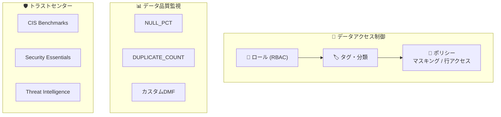

# Module 04: Horizonによるガバナンス

Snowflake Horizonを使用したデータガバナンス、セキュリティ、品質監視の実装方法を学びます。

---

## 📋 概要

**所要時間**: 約45分

### 学習目標

このモジュールを完了すると、以下ができるようになります：

- ✅ ロールベースアクセス制御（RBAC）の実装
- ✅ 自動タグ付けによるデータ分類
- ✅ マスキングポリシーによる列レベルセキュリティ
- ✅ 行アクセスポリシーによる行レベルセキュリティ
- ✅ データメトリック関数（DMF）による品質監視
- ✅ トラストセンターによるセキュリティ監視

---

## 📚 トピック

### 1. ロールとアクセス制御

**Snowflakeのアクセス制御**:
- **RBAC**: ロールに権限を割り当て、ロールをユーザーに割り当て
- **DAC**: オブジェクト所有者がアクセスを制御

```
              ACCOUNTADMIN
                   │
              SECURITYADMIN ─── SYSADMIN
                   │                │
              USERADMIN        カスタムロール
```

### 2. 自動タグ付けによるデータ分類

**目的**: 機密データを自動的に検出・タグ付け

```sql
-- 分類プロファイルの作成
CREATE SNOWFLAKE.DATA_PRIVACY.CLASSIFICATION_PROFILE profile_name(...);

-- 自動分類の実行
CALL SYSTEM$CLASSIFY('schema.table', 'profile_name');
```

**セマンティックカテゴリ**:
- NAME, EMAIL, PHONE_NUMBER, DATE_OF_BIRTH など

### 3. マスキングポリシー（列レベルセキュリティ）

**目的**: クエリ時に機密データを隠蔽

```sql
CREATE MASKING POLICY mask_pii AS (val STRING)
RETURNS STRING ->
  CASE WHEN CURRENT_ROLE() IN ('ADMIN') 
       THEN val 
       ELSE '****MASKED****' 
  END;
```

### 4. 行アクセスポリシー（行レベルセキュリティ）

**目的**: ロールに基づいて表示行を制限

```sql
CREATE ROW ACCESS POLICY region_policy AS (region STRING)
RETURNS BOOLEAN ->
  CURRENT_ROLE() = 'ADMIN' OR region = 'US';
```

### 5. データメトリック関数（DMF）

**目的**: データ品質の自動監視

```sql
-- システムDMF
SELECT SNOWFLAKE.CORE.NULL_PERCENT(SELECT col FROM table);

-- カスタムDMF
CREATE DATA METRIC FUNCTION my_check(...)
RETURNS NUMBER AS '...';
```

### 6. トラストセンター

**目的**: アカウントのセキュリティリスクを自動評価

- MFA有効化の確認
- 過剰権限ロールの検出
- 非アクティブユーザーの検出

---

## 🔧 ハンズオン手順

### Step 1: カスタムロールの作成

1. データスチュワードロールを作成
2. 必要な権限を付与
3. ロールを使用してデータにアクセス

### Step 2: 自動タグ付けの設定

1. PIIタグを作成
2. 分類プロファイルを作成
3. 自動分類を実行
4. タグ付け結果を確認

### Step 3: マスキングポリシーの適用

1. 文字列用マスキングポリシーを作成
2. 日付用マスキングポリシーを作成
3. PIIタグにポリシーをアタッチ
4. 異なるロールでクエリを実行して確認

### Step 4: 行アクセスポリシーの適用

1. 行ポリシーマップを作成
2. 行アクセスポリシーを作成
3. テーブルに適用
4. 結果を確認

### Step 5: データメトリック関数の設定

1. システムDMFを実行
2. カスタムDMFを作成
3. テーブルにDMFを割り当て

### Step 6: トラストセンターの確認

1. トラストセンターにアクセス
2. スキャナーパッケージを有効化
3. 違反を確認

---

## 📁 ファイル構成

| ファイル | 説明 |
|---------|------|
| `governance.sql` | メインSQLスクリプト |
| `reset.sql` | モジュールのリセットスクリプト |
| `slides/` | スライド資料 |

---

## 🔒 セキュリティアーキテクチャ



---

## ⚠️ 注意事項

### ロール切り替え

- このモジュールではロールを頻繁に切り替えます
- 現在のロールを常に確認してください
- 権限エラーはロール問題の可能性が高い

### マスキングポリシーの注意

- 一度適用すると、権限のないユーザーは元データを見れません
- テスト環境で十分に検証してから本番適用

### トラストセンター

- スキャナーパッケージの有効化には数分かかることがあります

---

## 🔄 リセット

このモジュールで作成したオブジェクトをクリーンアップする場合：

```sql
-- reset.sql を実行
```

---

## ✅ 確認問題

1. マスキングポリシーと行アクセスポリシーの違いは何ですか？

2. データメトリック関数はどのようなスケジュールで実行できますか？

3. トラストセンターのスキャナーパッケージは何を検出しますか？

---

## 📖 参考リンク

- [アクセス制御の概要](https://docs.snowflake.com/en/user-guide/security-access-control-overview)
- [自動タグ付け](https://docs.snowflake.com/en/user-guide/classify-auto)
- [列レベルセキュリティ](https://docs.snowflake.com/en/user-guide/security-column-intro)
- [行レベルセキュリティ](https://docs.snowflake.com/en/user-guide/security-row-intro)
- [データ品質](https://docs.snowflake.com/en/user-guide/data-quality-intro)
- [トラストセンター](https://docs.snowflake.com/en/user-guide/trust-center/overview)

---

## ➡️ 次のステップ

[Module 05: アプリとコラボレーション](../05_apps_collaboration/) に進んでください。

