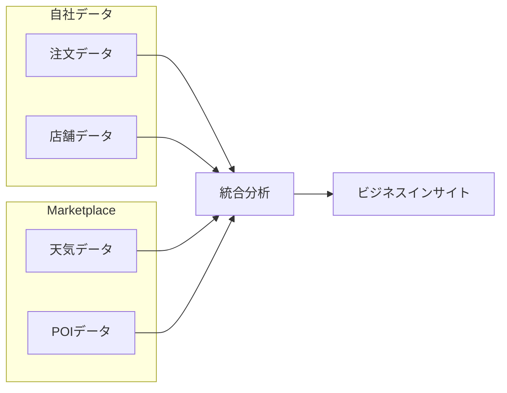

# Module 05: アプリとコラボレーション

> 🎯 **目標**: Snowflake Marketplaceで外部データを取得し、自社データと統合分析する

---

## 📂 このモジュールで使用するファイル

| ファイル | 説明 | 使い方 |
|---------|------|--------|
| [`apps_collaboration.sql`](./apps_collaboration.sql) | **メインスクリプト** | Snowsightで開いて順番に実行 |
| [`reset.sql`](./reset.sql) | リセット用 | やり直したい時に実行 |

---

## ⏱️ 所要時間

**約30分**（説明含む）

---

## 🎓 学習内容

| # | トピック | 内容 |
|---|---------|------|
| 1 | Marketplace | 外部データの取得 |
| 2 | Weather Source | 天気データとの統合分析 |
| 3 | Safegraph POI | 位置データとの統合分析 |

---

## 🌐 Snowflake Marketplaceとは？

**Marketplace** = サードパーティデータのハブ

- ✅ データ複製不要（ライブアクセス）
- ✅ 即座にクエリ可能
- ✅ 無料・有料のデータ製品
- ✅ アプリケーションも利用可能

---

## 📊 今回使用する外部データ

| データ | 提供元 | 内容 |
|--------|--------|------|
| **天気データ** | Weather Source | 日次の気温・降水量・風速など |
| **POIデータ** | Safegraph | 店舗の位置・カテゴリ・営業時間 |

---

# 🔰 ハンズオン手順

## Step 0: 準備

### SQLファイルを準備

1. **Snowsight** にログイン
2. GitHubで [`apps_collaboration.sql`](./apps_collaboration.sql) を開き、**Raw** → 全文コピー
3. **Projects** → **Worksheets** → **+** で新規ワークシートを作成
4. コピーした内容をペースト

### コンテキストを設定

画面右上のコンテキストパネルで以下を設定：
- **Role**: `ACCOUNTADMIN`
- **Database**: `TB_101`
- **Warehouse**: `TB_DE_WH`

```sql
-- apps_collaboration.sql: 18-20行目
USE DATABASE tb_101;
USE ROLE accountadmin;
USE WAREHOUSE tb_de_wh;
```

---

## Step 1: Marketplaceから天気データを取得

📍 **SQLファイル**: [`apps_collaboration.sql`](./apps_collaboration.sql) の **22〜53行目**

### 1-1. Marketplaceにアクセス

1. Snowsightの左メニューから **Marketplace** をクリック
2. 検索バーに「**Weather Source frostbyte**」と入力
3. 「**Weather Source LLC: frostbyte**」を選択

### 1-2. データを取得

1. **Get** をクリック
2. **Options** を展開
3. データベース名を「`ZTS_WEATHERSOURCE`」に変更
4. 「**PUBLIC**」にアクセスを許可
5. **Get** をクリック

> ⏱️ 数秒でデータにアクセス可能！（コピー不要）

### 取得されるデータ構造

```
ZTS_WEATHERSOURCE
├── ONPOINT_ID
│   ├── history_day     ← 日次天気履歴
│   └── postal_codes    ← 郵便番号マスター
```

---

## Step 2: 天気データとの統合分析

📍 **SQLファイル**: [`apps_collaboration.sql`](./apps_collaboration.sql) の **55〜166行目**

### 2-1. 天気データを確認

```sql
USE ROLE tb_analyst;

SELECT 
    DISTINCT city_name,
    AVG(max_wind_speed_100m_mph) AS avg_wind_speed_mph,
    AVG(avg_temperature_air_2m_f) AS avg_temp_f,
    AVG(tot_precipitation_in) AS avg_precipitation_in,
    MAX(tot_snowfall_in) AS max_snowfall_in
FROM zts_weathersource.onpoint_id.history_day
WHERE country = 'US'
GROUP BY city_name;
```

### 2-2. 日次天気ビューを作成

```sql
CREATE OR REPLACE VIEW harmonized.daily_weather_v
COMMENT = 'Tasty Bytesがサポートする都市にフィルタリングされたWeather Source日次履歴'
AS
SELECT
    hd.*,
    TO_VARCHAR(hd.date_valid_std, 'YYYY-MM') AS yyyy_mm,
    pc.city_name AS city,
    c.country AS country_desc
FROM zts_weathersource.onpoint_id.history_day hd
JOIN zts_weathersource.onpoint_id.postal_codes pc
    ON pc.postal_code = hd.postal_code AND pc.country = hd.country
JOIN raw_pos.country c
    ON c.iso_country = hd.country AND c.city = hd.city_name;
```

### 2-3. 特定都市の気温推移を確認

```sql
SELECT
    dw.country_desc,
    dw.city_name,
    dw.date_valid_std,
    AVG(dw.avg_temperature_air_2m_f) AS average_temp_f
FROM harmonized.daily_weather_v dw
WHERE dw.country_desc = 'Germany'
    AND dw.city_name = 'Hamburg'
    AND YEAR(date_valid_std) = 2022
    AND MONTH(date_valid_std) = 2
GROUP BY dw.country_desc, dw.city_name, dw.date_valid_std
ORDER BY dw.date_valid_std DESC;
```

> 📊 **チャート表示**: 結果パネルで「Chart」をクリック → 折れ線グラフで可視化

### 2-4. 天気別売上ビューを作成

```sql
CREATE OR REPLACE VIEW analytics.daily_sales_by_weather_v
COMMENT = '日次天気メトリクスと注文データ'
AS
WITH daily_orders_aggregated AS (
    SELECT
        DATE(o.order_ts) AS order_date,
        o.primary_city,
        o.country,
        o.menu_item_name,
        SUM(o.price) AS total_sales
    FROM harmonized.orders_v o
    GROUP BY ALL
)
SELECT
    dw.date_valid_std AS date,
    dw.city_name,
    dw.country_desc,
    ZEROIFNULL(doa.total_sales) AS daily_sales,
    doa.menu_item_name,
    ROUND(dw.avg_temperature_air_2m_f, 2) AS avg_temp_fahrenheit,
    ROUND(dw.tot_precipitation_in, 2) AS avg_precipitation_inches,
    ROUND(dw.tot_snowdepth_in, 2) AS avg_snowdepth_inches,
    dw.max_wind_speed_100m_mph AS max_wind_speed_mph
FROM harmonized.daily_weather_v dw
LEFT JOIN daily_orders_aggregated doa
    ON dw.date_valid_std = doa.order_date
    AND dw.city_name = doa.primary_city
    AND dw.country_desc = doa.country
ORDER BY date ASC;
```

### 2-5. 大雨時の売上を分析

```sql
SELECT * EXCLUDE (city_name, country_desc, avg_snowdepth_inches, max_wind_speed_mph)
FROM analytics.daily_sales_by_weather_v
WHERE 
    country_desc = 'United States'
    AND city_name = 'Seattle'
    AND avg_precipitation_inches >= 1.0
ORDER BY date ASC;
```

> 💡 **ビジネスインサイト**: 大雨の日に売れるメニューは？

---

## Step 3: Safegraph POIデータの取得

📍 **SQLファイル**: [`apps_collaboration.sql`](./apps_collaboration.sql) の **168〜265行目**

### 3-1. Marketplaceからデータを取得

1. **Marketplace** → 検索「**safegraph frostbyte**」
2. 「**Safegraph: frostbyte**」を選択
3. **Get** → データベース名「`ZTS_SAFEGRAPH`」
4. 「**PUBLIC**」にアクセスを許可 → **Get**

### 取得されるデータ構造

```
ZTS_SAFEGRAPH
└── PUBLIC
    └── frostbyte_tb_safegraph_s  ← POIデータ
        - location_id
        - postal_code
        - city
        - location_name
        - top_category
        - includes_parking_lot
        - open_hours
```

---

## Step 4: 天気×POI×売上の統合分析

### 4-1. POIビューを作成

```sql
CREATE OR REPLACE VIEW harmonized.tastybytes_poi_v AS 
SELECT 
    l.location_id,
    sg.postal_code,
    sg.country,
    sg.city,
    sg.iso_country_code,
    sg.location_name,
    sg.top_category,
    sg.category_tags,
    sg.includes_parking_lot,
    sg.open_hours
FROM raw_pos.location l
JOIN zts_safegraph.public.frostbyte_tb_safegraph_s sg 
    ON l.location_id = sg.location_id
    AND l.iso_country_code = sg.iso_country_code;
```

### 4-2. 最も風の強いロケーションTOP3を特定

```sql
SELECT TOP 3
    p.location_id,
    p.city,
    p.postal_code,
    AVG(hd.max_wind_speed_100m_mph) AS average_wind_speed
FROM harmonized.tastybytes_poi_v AS p
JOIN zts_weathersource.onpoint_id.history_day AS hd
    ON p.postal_code = hd.postal_code
WHERE p.country = 'United States' AND YEAR(hd.date_valid_std) = 2022
GROUP BY p.location_id, p.city, p.postal_code
ORDER BY average_wind_speed DESC;
```

### 4-3. 風の強い日と穏やかな日の売上比較

```sql
WITH TopWindiestLocations AS (
    SELECT TOP 3 p.location_id
    FROM harmonized.tastybytes_poi_v AS p
    JOIN zts_weathersource.onpoint_id.history_day AS hd
        ON p.postal_code = hd.postal_code
    WHERE p.country = 'United States' AND YEAR(hd.date_valid_std) = 2022
    GROUP BY p.location_id, p.city, p.postal_code
    ORDER BY AVG(hd.max_wind_speed_100m_mph) DESC
)
SELECT
    o.truck_brand_name,
    ROUND(AVG(CASE WHEN hd.max_wind_speed_100m_mph <= 20 THEN o.order_total END), 2) AS avg_sales_calm_days,
    ZEROIFNULL(ROUND(AVG(CASE WHEN hd.max_wind_speed_100m_mph > 20 THEN o.order_total END), 2)) AS avg_sales_windy_days
FROM analytics.orders_v AS o
JOIN zts_weathersource.onpoint_id.history_day AS hd
    ON o.primary_city = hd.city_name AND DATE(o.order_ts) = hd.date_valid_std
WHERE o.location_id IN (SELECT location_id FROM TopWindiestLocations)
GROUP BY o.truck_brand_name
ORDER BY o.truck_brand_name;
```

### ビジネスインサイト

**穏やかな日 vs 風の強い日 の売上比較**

- どのブランドが「天候に強い」か？
- 風の強い日にプロモーションすべきか？
- 在庫調整の判断材料

---

# 🎉 全モジュール完了！

```sql
SELECT '🎉 全モジュール完了！お疲れさまでした！' AS message;
```

---

## 📊 まとめ: 統合分析の流れ



---

## 🔄 リセット

やり直したい場合は [`reset.sql`](./reset.sql) を実行してください。

---

## 🏆 ハンズオン全体の振り返り

| モジュール | 習得スキル |
|-----------|----------|
| **01 Getting Started** | ウェアハウス、クエリキャッシュ、ゼロコピークローン、UNDROP |
| **02 Data Pipelines** | 外部ステージ、VARIANT、Dynamic Tables |
| **03 Cortex AI** | SENTIMENT、AI_CLASSIFY、EXTRACT_ANSWER、AI_SUMMARIZE_AGG |
| **04 Governance** | RBAC、マスキング、行アクセスポリシー、DMF |
| **05 Apps & Collaboration** | Marketplace、外部データ統合 |

---

## 📚 参考リンク（任意）

- [Snowflake Marketplace](https://docs.snowflake.com/en/user-guide/data-sharing-intro)
- [データ共有の概要](https://docs.snowflake.com/en/user-guide/data-sharing-overview)
- [Weather Source](https://app.snowflake.com/marketplace/listing/GZSNZ7F5UT)
- [Safegraph](https://app.snowflake.com/marketplace/listing/GZT0ZGYXTMX)
