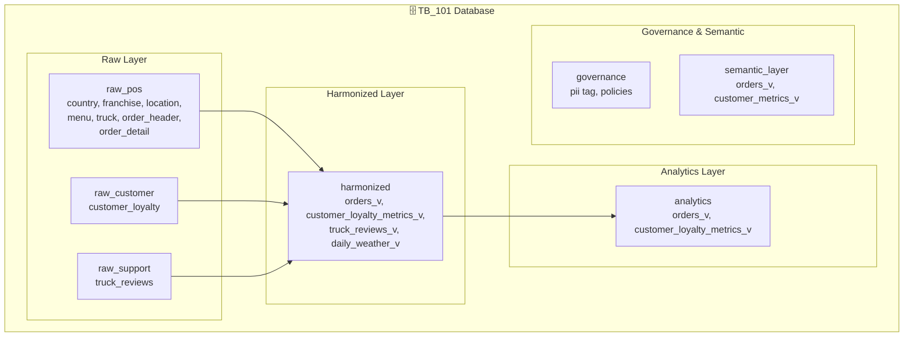
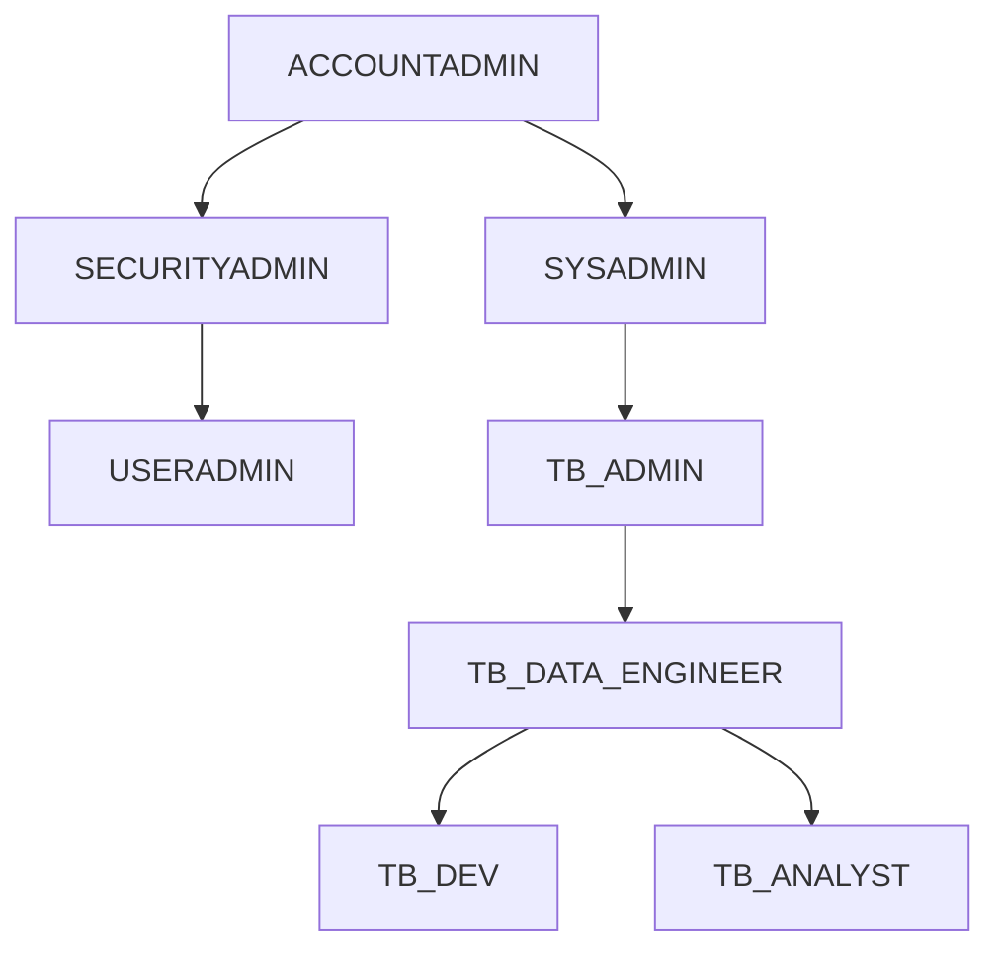

# Zero to Snowflake ハンズオン

Snowflakeの基本機能から高度なAI/ML機能、ガバナンスまでを体系的に学ぶハンズオン教材です。  
架空のフードトラック企業「**Tasty Bytes**」のデータを使用して、実践的なスキルを習得します。

---

## 📚 モジュール構成

| モジュール | 内容 | 所要時間（目安） |
|-----------|------|----------------|
| [00_setup](./00_setup/) | 環境セットアップ | 15分 |
| [01_getting_started](./01_getting_started/) | Snowflakeの基本操作 | 45分 |
| [02_data_pipelines](./02_data_pipelines/) | データパイプライン構築 | 45分 |
| [03_cortex_ai](./03_cortex_ai/) | Cortex AI SQL関数 | 30分 |
| [04_governance](./04_governance/) | Horizonによるガバナンス | 45分 |
| [05_apps_collaboration](./05_apps_collaboration/) | Marketplace・アプリ連携 | 30分 |

**合計所要時間**: 約3.5時間

---

## ⏱️ 推奨コース

時間や目的に応じて、以下のコースをお選びください。

### 🚀 90分クイックコース（推奨）

**初めてSnowflakeに触れる方に最適！**

| 順番 | モジュール | 時間 | 内容 |
|:---:|-----------|:----:|------|
| 1 | [00_setup](./00_setup/) | 15分 | 環境構築 |
| 2 | [01_getting_started](./01_getting_started/) | 45分 | 基本操作（ウェアハウス、クローン、UNDROP） |
| 3 | [03_cortex_ai](./03_cortex_ai/) | 30分 | AIをSQLで体験！ |

```
セットアップ → 基本操作 → AI体験 → 「Snowflakeすごい！」
```

### 📊 2時間エンジニアコース

**データエンジニア・開発者向け**

| 順番 | モジュール | 時間 |
|:---:|-----------|:----:|
| 1 | [00_setup](./00_setup/) | 15分 |
| 2 | [01_getting_started](./01_getting_started/) | 45分 |
| 3 | [02_data_pipelines](./02_data_pipelines/) | 45分 |

Dynamic Tablesによる宣言的ETLを体験できます。

### 🔒 ガバナンス重点コース

**セキュリティ・コンプライアンス担当者向け**

| 順番 | モジュール | 時間 |
|:---:|-----------|:----:|
| 1 | [00_setup](./00_setup/) | 15分 |
| 2 | [04_governance](./04_governance/) | 45分 |

マスキング、行アクセスポリシー、自動分類を体験できます。

### 📚 フルコース（3.5時間）

すべてのモジュールを順番に実施します。休憩を挟みながら進めてください。

---

## 🎯 学習目標

このハンズオンを完了すると、以下のスキルを習得できます：

### 基本スキル
- ✅ 仮想ウェアハウスの作成・管理・スケーリング
- ✅ クエリ結果キャッシュの活用
- ✅ ゼロコピークローンによる開発環境構築
- ✅ Time Travel（UNDROP）によるデータ復旧

### データエンジニアリング
- ✅ 外部ステージからのデータ取り込み
- ✅ 半構造化データ（VARIANT）の操作
- ✅ Dynamic Tablesによる宣言的パイプライン
- ✅ DAGによるデータフロー可視化

### AI/ML
- ✅ Cortex AI関数（SENTIMENT, AI_CLASSIFY, EXTRACT_ANSWER, AI_SUMMARIZE_AGG）
- ✅ 大規模データに対する自然言語分析

### ガバナンス・セキュリティ
- ✅ ロールベースアクセス制御（RBAC）
- ✅ 自動タグ付けによるデータ分類
- ✅ マスキングポリシー（列レベルセキュリティ）
- ✅ 行アクセスポリシー（行レベルセキュリティ）
- ✅ データメトリック関数（DMF）による品質監視

### コラボレーション
- ✅ Snowflake Marketplaceからのデータ取得
- ✅ 外部データとの統合分析

---

## 🚀 クイックスタート

### 前提条件

- Snowflakeアカウント（トライアルアカウント可）
- ACCOUNTADMIN ロールへのアクセス
- Webブラウザ（Chrome推奨）

### セットアップ手順

1. **Snowsightにログイン**
   - [app.snowflake.com](https://app.snowflake.com) にアクセス

2. **ワークシートを作成**
   - 左メニューから「Worksheets」を選択
   - 「+」ボタンで新規ワークシートを作成

3. **セットアップSQLを実行**
   - `00_setup/setup.sql` の内容をワークシートにコピー
   - 全体を選択して実行（約10-15分）

4. **各モジュールを順番に実行**
   - 01 → 02 → 03 → 04 → 05 の順番で進めてください

---

## 📁 フォルダ構成

```
Zero-to-Snowflake-Handson/
├── README.md                    # このファイル
│
├── 00_setup/                    # 環境セットアップ
│   ├── README.md
│   ├── setup.sql
│   └── cleanup.sql
│
├── 01_getting_started/          # モジュール1: 基本操作
│   ├── README.md
│   ├── getting_started.sql
│   ├── reset.sql
│   └── slides/
│
├── 02_data_pipelines/           # モジュール2: データパイプライン
│   ├── README.md
│   ├── data_pipelines.sql
│   ├── reset.sql
│   └── slides/
│
├── 03_cortex_ai/                # モジュール3: AI SQL関数
│   ├── README.md
│   ├── cortex_ai.sql
│   ├── reset.sql
│   └── slides/
│
├── 04_governance/               # モジュール4: ガバナンス
│   ├── README.md
│   ├── governance.sql
│   ├── reset.sql
│   └── slides/
│
├── 05_apps_collaboration/       # モジュール5: Marketplace連携
│   ├── README.md
│   ├── apps_collaboration.sql
│   ├── reset.sql
│   └── slides/
│
└── resources/                   # 追加リソース
    ├── architecture.md
    ├── faq.md
    └── troubleshooting.md
```

---

## 🏗️ アーキテクチャ

### データモデル概要



### ロール階層



---

## 🔗 関連リソース

- [Snowflake Documentation](https://docs.snowflake.com/)
- [Snowflake Quickstarts](https://quickstarts.snowflake.com/)
- [Tasty Bytes - Data for All](https://quickstarts.snowflake.com/guide/tasty_bytes_introduction/)

---

## 📝 ライセンス

Copyright (c) 2025 Snowflake Inc. All rights reserved.

---

## 🤝 お問い合わせ

ご質問やフィードバックがございましたら、お気軽にお問い合わせください。
