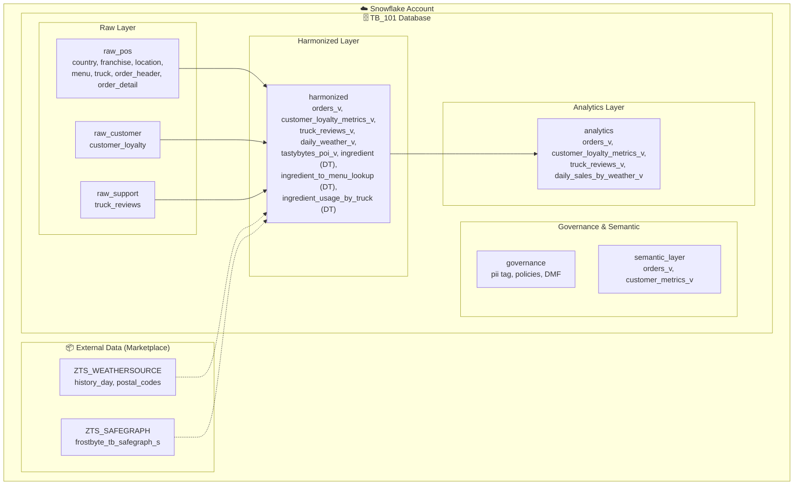
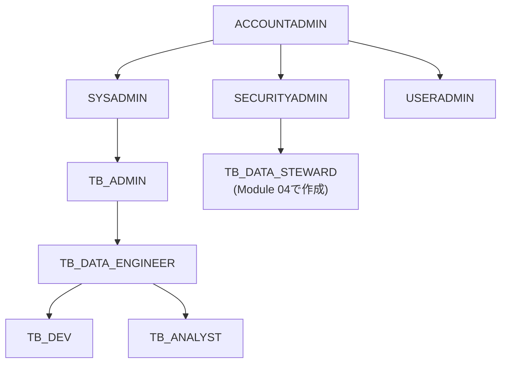
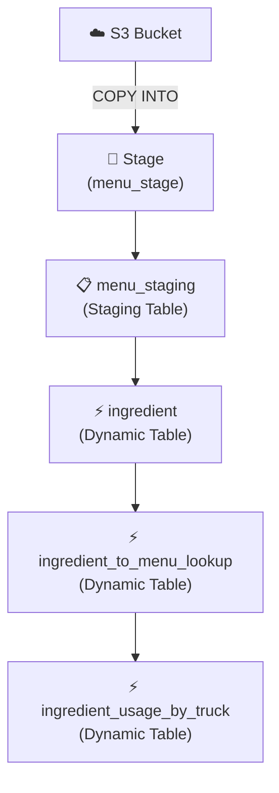
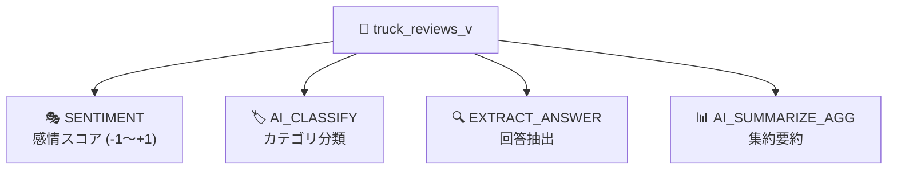
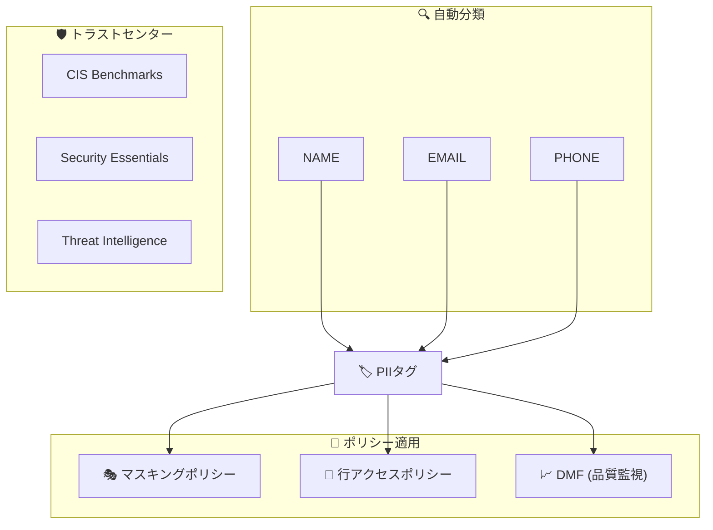
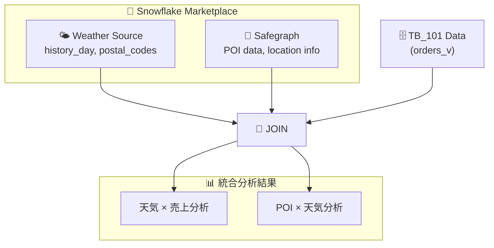

# アーキテクチャ概要

Zero to Snowflake ハンズオンで使用するアーキテクチャの詳細説明です。

---

## 🏗️ 全体アーキテクチャ

---

## 👥 ロール階層

### ロール説明

| ロール | 説明 | 主な権限 |
|--------|------|----------|
| `ACCOUNTADMIN` | 最上位管理者 | すべての権限 |
| `SYSADMIN` | システム管理者 | WH/DB作成 |
| `SECURITYADMIN` | セキュリティ管理者 | ロール/権限管理 |
| `TB_ADMIN` | TB管理者 | TB環境の管理 |
| `TB_DATA_ENGINEER` | データエンジニア | ETL/パイプライン |
| `TB_DEV` | 開発者 | 開発環境アクセス |
| `TB_ANALYST` | アナリスト | 分析クエリ |
| `TB_DATA_STEWARD` | データスチュワード | ガバナンス管理 |

---

## 🗄️ スキーマ構成

### raw_pos（生データ - POS）

| テーブル | 説明 | 主要カラム |
|----------|------|-----------|
| `country` | 国・都市マスタ | country_id, country, city |
| `franchise` | フランチャイズ情報 | franchise_id, first_name, last_name |
| `location` | ロケーション情報 | location_id, city, country |
| `menu` | メニュー情報 | menu_id, menu_item_name, sale_price |
| `truck` | トラック情報 | truck_id, primary_city, franchise_id |
| `order_header` | 注文ヘッダー | order_id, truck_id, order_ts |
| `order_detail` | 注文明細 | order_detail_id, order_id, quantity |

### raw_customer（生データ - 顧客）

| テーブル | 説明 | 主要カラム |
|----------|------|-----------|
| `customer_loyalty` | ロイヤルティ会員 | customer_id, first_name, email |

### raw_support（生データ - サポート）

| テーブル | 説明 | 主要カラム |
|----------|------|-----------|
| `truck_reviews` | トラックレビュー | review_id, review, language |

### harmonized（統合データ）

| オブジェクト | タイプ | 説明 |
|-------------|--------|------|
| `orders_v` | View | 注文統合ビュー |
| `customer_loyalty_metrics_v` | View | 顧客メトリクス |
| `truck_reviews_v` | View | レビュー統合 |
| `daily_weather_v` | View | 日次天気 |
| `tastybytes_poi_v` | View | POI統合 |
| `ingredient` | Dynamic Table | 成分マスタ |
| `ingredient_to_menu_lookup` | Dynamic Table | 成分→メニュー |
| `ingredient_usage_by_truck` | Dynamic Table | 成分使用量 |

### analytics（分析用）

| オブジェクト | タイプ | 説明 |
|-------------|--------|------|
| `orders_v` | View | 分析用注文ビュー |
| `customer_loyalty_metrics_v` | View | 顧客分析 |
| `truck_reviews_v` | View | レビュー分析 |
| `daily_sales_by_weather_v` | View | 天気×売上 |

---

## ⚙️ ウェアハウス構成

| ウェアハウス | サイズ | 用途 |
|-------------|--------|------|
| `TB_DE_WH` | Large→XSmall | データエンジニアリング、初期ロード |
| `TB_DEV_WH` | X-Small | 開発・テスト |
| `TB_ANALYST_WH` | Large | 分析クエリ、Cortex AI |
| `TB_CORTEX_WH` | Large | Cortex Analyst |

---

## 🔄 データフロー

### ETLパイプライン（Module 02）

### AI分析フロー（Module 03）

---

## 🛡️ セキュリティアーキテクチャ（Module 04）

---

## 🌐 外部連携（Module 05）

